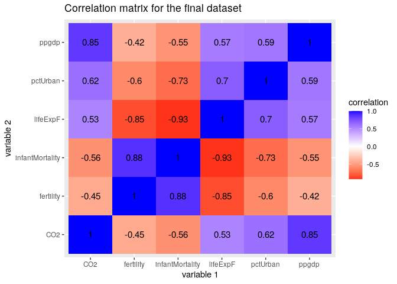
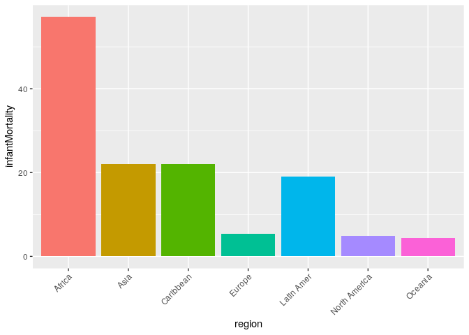
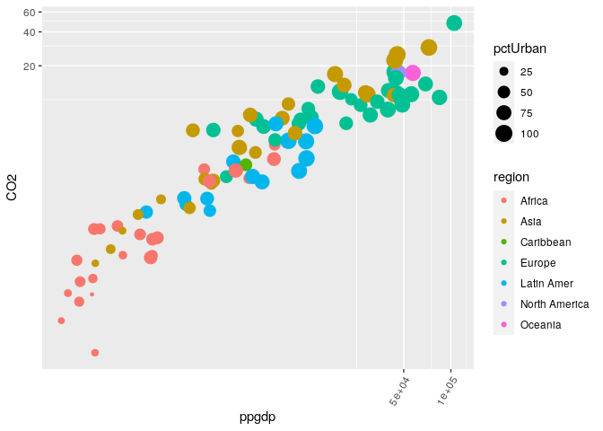
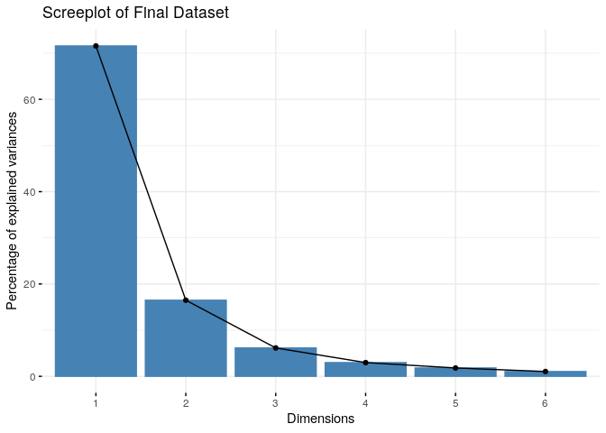
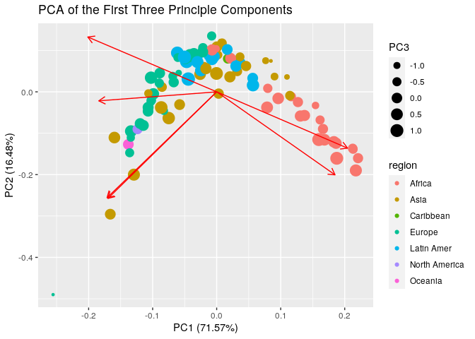

CO2 Emissions and their Impact on Infant Mortality in Countries Around
the World.
================
Stephen Koenig
3/19/2021

## Introduction

The data for this project came from the `carData` package which was
modified to list the country names as a variable along with the life
expectancy for a female, the ppgdp, infant mortality rate, percent
urban, and the region the countries resides. The second dataset came
from <https://www.gapminder.org/data/>, using data for the Per capita
carbon dioxide emissions from the fossil fuel consumption etc. in a
given year. This data is interesting to me to see the impact of
CO<sub>2</sub> emissions from urban and rural areas on infant mortality
rates and life expectancy. I expect to see a positive linear
relationship between percent urban and the CO<sub>2</sub> emissions, as
well as a negative relationship between percent urban and infant
mortality due to better access to health care and other services.

## Tidy

``` r
emtemp <- emissions %>%
  #Selecting the two variables to add to the new dataset: country and 2010 emission/person in tonnes.
  select(country, `2010`)
#Checking to see if the new `emission` dataset `emtemp` and `UN` is tidy.
head(emtemp)
```

    ## # A tibble: 6 x 2
    ##   country    `2010`
    ##   <chr>       <dbl>
    ## 1 Albania      2.08
    ## 2 Argentina    4.33
    ## 3 Armenia      1.92
    ## 4 Australia   17.3 
    ## 5 Austria     11.6 
    ## 6 Azerbaijan   3.41

``` r
head(UN)
```

    ## # A tibble: 6 x 8
    ##   country      region   group fertility  ppgdp lifeExpF pctUrban infantMortality
    ##   <chr>        <chr>    <chr>     <dbl>  <dbl>    <dbl>    <dbl>           <dbl>
    ## 1 Afghanistan  Asia     other      5.97   499      49.5       23           125. 
    ## 2 Albania      Europe   other      1.52  3677.     80.4       53            16.6
    ## 3 Algeria      Africa   afri…      2.14  4473      75         67            21.5
    ## 4 American Sa… <NA>     <NA>      NA       NA      NA         NA            11.3
    ## 5 Angola       Africa   afri…      5.14  4322.     53.2       59            96.2
    ## 6 Anguilla     Caribbe… other      2    13750.     81.1      100            NA

## Join/Merge

An inner join was performed to get a dataset that only has countries who
have values from both datasets. This removes all rows that have NA’s in
either dataset. (117 from UN and 19 from emissions). After joining, the
data was reorganized.

``` r
datatemp <- emtemp %>%
  inner_join(UN, by="country")

#Cleaning the dataset after merging
datafinal <- datatemp %>%
  #Reordering the variables, and removing the `groups` category since it is unnecessary.
  select(country, region, -group, fertility, ppgdp, `2010`, lifeExpF, pctUrban, infantMortality) %>%
  #Renaming the `2020` variable to a more accurate descriptive name.
  rename("CO2" = `2010`)

#making a dataset variation with only numeric variables
datafinal_num <- datafinal %>%
  select_if(is.numeric) 
```

## Summary Statistics

The mean fertility rate for all countries was 2.5 children per woman,
but for specific regions, this number was much higher (Africa) or much
lower (Europe). Infant mortality rates also acted in the same way, with
a mean of 24.5 children out of 1000, with some countries being as high
as 92, or as low as 1.9 of every 1000 infants. However, the ppgdp as
well as CO2 emissions per person and the life expectancy, have countries
in Europe with the higher values, and African countries having a much
lower value.

``` r
#Calculating summary of fertility for each country
Fertility <- datafinal %>%
  summarize(Data = 'fertility', 
            N = n(),
            Min = min(fertility),
            Mean = mean(fertility),
            Max = max(fertility),
            SD = sd(fertility),
            Variance = var(fertility))
#Calculating summary of ppgdp for each country
ppgdp <- datafinal %>%
  summarize(Data = 'ppgdp', 
            N = n(),
            Min = min(ppgdp),
            Mean = mean(ppgdp),
            Max = max(ppgdp),
            SD = sd(ppgdp),
            Variance = var(ppgdp))
#Calculating summary of CO2 emission per person for each country
CO2 <- datafinal %>%
  summarize(Data = 'CO2', 
            N = n(),
            Min = min(CO2),
            Mean = mean(CO2),
            Max = max(CO2),
            SD = sd(CO2),
            Variance = var(CO2))
#Calculating summary of life expectancy for each country
LifeExpectancy <- datafinal %>%
  summarize(Data = 'lifeExpF', 
            N = n(),
            Min = min(lifeExpF),
            Mean = mean(lifeExpF),
            Max = max(lifeExpF),
            SD = sd(lifeExpF),
            Variance = var(lifeExpF))
#Calculating summary of percentage urban for each country
Urban <- datafinal %>%
  summarize(Data = 'pctUrban', 
            N = n(),
            Min = min(pctUrban),
            Mean = mean(pctUrban),
            Max = max(pctUrban),
            SD = sd(pctUrban),
            Variance = var(pctUrban))
#Calculating summary of infant mortality for each country
infantM <- datafinal %>%
  summarize(Data = 'infantMortality', 
            N = n(),
            Min = min(infantMortality),
            Mean = mean(infantMortality),
            Max = max(infantMortality),
            SD = sd(infantMortality),
            Variance = var(infantMortality))

#Grouped
#Calculating summary of fertility grouped by region
FertilityRegion <- datafinal %>%
  group_by(region) %>%
  summarize(Data = 'fertility', 
            N = n(),
            Min = min(fertility),
            Mean = mean(fertility),
            Max = max(fertility),
            SD = sd(fertility),
            Variance = var(fertility))
#Calculating summary of ppgdp grouped by region
ppgdpRegion <- datafinal %>%
  group_by(region) %>%
  summarize(Data = 'ppgdp', 
            N = n(),
            Min = min(ppgdp),
            Mean = mean(ppgdp),
            Max = max(ppgdp),
            SD = sd(ppgdp),
            Variance = var(ppgdp))
#Calculating summary of CO2 emission per person grouped by region
CO2Region <- datafinal %>%
  group_by(region) %>%
  summarize(Data = 'CO2', 
            N = n(),
            Min = min(CO2),
            Mean = mean(CO2),
            Max = max(CO2),
            SD = sd(CO2),
            Variance = var(CO2))
#Calculating summary of life expectancy grouped by region
LifeExpectancyRegion <- datafinal %>%
  group_by(region) %>%
  summarize(Data = 'lifeExpF', 
            N = n(),
            Min = min(lifeExpF),
            Mean = mean(lifeExpF),
            Max = max(lifeExpF),
            SD = sd(lifeExpF),
            Variance = var(lifeExpF))
#Calculating summary of percentage urban grouped by region
UrbanRegion <- datafinal %>%
  group_by(region) %>%
  summarize(Data = 'pctUrban', 
            N = n(),
            Min = min(pctUrban),
            Mean = mean(pctUrban),
            Max = max(pctUrban),
            SD = sd(pctUrban),
            Variance = var(pctUrban))
#Calculating summary of infant mortality grouped by region
infantMRegion <- datafinal %>%
  group_by(region) %>%
  summarize(Data = 'infantMortality', 
            N = n(),
            Min = min(infantMortality),
            Mean = mean(infantMortality),
            Max = max(infantMortality),
            SD = sd(infantMortality),
            Variance = var(infantMortality))

data <- Fertility %>%
  full_join(ppgdp) %>%
  full_join(CO2) %>%
  full_join(LifeExpectancy) %>%
  full_join(Urban) %>%
  full_join(infantM) %>%
  full_join(FertilityRegion) %>%
  full_join(ppgdpRegion) %>%
  full_join(CO2Region) %>%
  full_join(LifeExpectancyRegion) %>%
  full_join(UrbanRegion) %>%  
  full_join(infantMRegion)  


kable(data)
```

| Data            |  N |        Min |         Mean |        Max |           SD |     Variance | region        |
| :-------------- | -: | ---------: | -----------: | ---------: | -----------: | -----------: | :------------ |
| fertility       | 96 |     1.2840 | 2.525677e+00 |      6.300 | 1.235034e+00 | 1.525309e+00 | NA            |
| ppgdp           | 96 |   324.6000 | 1.611405e+04 | 105095.400 | 2.119242e+04 | 4.491185e+08 | NA            |
| CO2             | 96 |     0.0572 | 6.341846e+00 |     47.900 | 7.324861e+00 | 5.365359e+01 | NA            |
| lifeExpF        | 96 |    50.0400 | 7.423573e+01 |     87.120 | 9.543525e+00 | 9.107887e+01 | NA            |
| pctUrban        | 96 |    13.0000 | 6.170833e+01 |    100.000 | 2.176231e+01 | 4.735982e+02 | NA            |
| infantMortality | 96 |     1.9160 | 2.454103e+01 |     92.870 | 2.479620e+01 | 6.148515e+02 | NA            |
| fertility       | 23 |     1.5900 | 4.174391e+00 |      6.300 | 1.362057e+00 | 1.855199e+00 | Africa        |
| fertility       | 26 |     1.3670 | 2.180308e+00 |      3.201 | 5.351894e-01 | 2.864277e-01 | Asia          |
| fertility       |  1 |     2.2620 | 2.262000e+00 |      2.262 |           NA |           NA | Caribbean     |
| fertility       | 29 |     1.2840 | 1.602448e+00 |      2.097 | 2.207747e-01 | 4.874150e-02 | Europe        |
| fertility       | 15 |     1.8000 | 2.492867e+00 |      3.840 | 5.418358e-01 | 2.935860e-01 | Latin Amer    |
| fertility       |  1 |     1.6910 | 1.691000e+00 |      1.691 |           NA |           NA | North America |
| fertility       |  1 |     1.9490 | 1.949000e+00 |      1.949 |           NA |           NA | Oceania       |
| ppgdp           | 23 |   324.6000 | 1.823635e+03 |   7488.300 | 2.179034e+03 | 4.748189e+06 | Africa        |
| ppgdp           | 26 |   534.7000 | 1.426053e+04 |  72397.900 | 1.858695e+04 | 3.454748e+08 | Asia          |
| ppgdp           |  1 |  4899.0000 | 4.899000e+03 |   4899.000 |           NA |           NA | Caribbean     |
| ppgdp           | 29 |  3035.0000 | 3.191109e+04 | 105095.400 | 2.507529e+04 | 6.287700e+08 | Europe        |
| ppgdp           | 15 |  1131.9000 | 6.695380e+03 |  13502.700 | 4.170584e+03 | 1.739377e+07 | Latin Amer    |
| ppgdp           |  1 | 46360.9000 | 4.636090e+04 |  46360.900 |           NA |           NA | North America |
| ppgdp           |  1 | 57118.9000 | 5.711890e+04 |  57118.900 |           NA |           NA | Oceania       |
| CO2             | 23 |     0.0572 | 9.781826e-01 |      3.990 | 1.075968e+00 | 1.157708e+00 | Africa        |
| CO2             | 26 |     0.3550 | 7.749192e+00 |     29.100 | 7.984613e+00 | 6.375404e+01 | Asia          |
| CO2             |  1 |     2.6500 | 2.650000e+00 |      2.650 |           NA |           NA | Caribbean     |
| CO2             | 29 |     2.0800 | 1.050103e+01 |     47.900 | 7.980967e+00 | 6.369583e+01 | Europe        |
| CO2             | 15 |     1.0100 | 2.864000e+00 |      6.120 | 1.732355e+00 | 3.001054e+00 | Latin Amer    |
| CO2             |  1 |    17.4000 | 1.740000e+01 |     17.400 |           NA |           NA | North America |
| CO2             |  1 |    17.3000 | 1.730000e+01 |     17.300 |           NA |           NA | Oceania       |
| lifeExpF        | 23 |    50.0400 | 6.081696e+01 |     77.050 | 8.502996e+00 | 7.230094e+01 | Africa        |
| lifeExpF        | 26 |    65.1000 | 7.535769e+01 |     87.120 | 5.243081e+00 | 2.748990e+01 | Asia          |
| lifeExpF        |  1 |    75.9800 | 7.598000e+01 |     75.980 |           NA |           NA | Caribbean     |
| lifeExpF        | 29 |    74.5800 | 8.144034e+01 |     84.900 | 2.759390e+00 | 7.614232e+00 | Europe        |
| lifeExpF        | 15 |    69.4000 | 7.753533e+01 |     82.350 | 3.038658e+00 | 9.233441e+00 | Latin Amer    |
| lifeExpF        |  1 |    83.4900 | 8.349000e+01 |     83.490 |           NA |           NA | North America |
| lifeExpF        |  1 |    84.2700 | 8.427000e+01 |     84.270 |           NA |           NA | Oceania       |
| pctUrban        | 23 |    13.0000 | 3.934783e+01 |     68.000 | 1.502606e+01 | 2.257826e+02 | Africa        |
| pctUrban        | 26 |    19.0000 | 6.076923e+01 |    100.000 | 2.391871e+01 | 5.721046e+02 | Asia          |
| pctUrban        |  1 |    52.0000 | 5.200000e+01 |     52.000 |           NA |           NA | Caribbean     |
| pctUrban        | 29 |    49.0000 | 7.237931e+01 |     97.000 | 1.215205e+01 | 1.476724e+02 | Europe        |
| pctUrban        | 15 |    50.0000 | 7.453333e+01 |     94.000 | 1.484138e+01 | 2.202667e+02 | Latin Amer    |
| pctUrban        |  1 |    81.0000 | 8.100000e+01 |     81.000 |           NA |           NA | North America |
| pctUrban        |  1 |    89.0000 | 8.900000e+01 |     89.000 |           NA |           NA | Oceania       |
| infantMortality | 23 |    12.1120 | 5.709661e+01 |     92.870 | 2.495527e+01 | 6.227656e+02 | Africa        |
| infantMortality | 26 |     1.9160 | 2.197435e+01 |     65.724 | 1.672338e+01 | 2.796716e+02 | Asia          |
| infantMortality |  1 |    22.0230 | 2.202300e+01 |     22.023 |           NA |           NA | Caribbean     |
| infantMortality | 29 |     2.2890 | 5.321276e+00 |     16.561 | 3.264552e+00 | 1.065730e+01 | Europe        |
| infantMortality | 15 |     6.7920 | 1.904420e+01 |     40.684 | 8.068139e+00 | 6.509486e+01 | Latin Amer    |
| infantMortality |  1 |     4.9260 | 4.926000e+00 |      4.926 |           NA |           NA | North America |
| infantMortality |  1 |     4.4550 | 4.455000e+00 |      4.455 |           NA |           NA | Oceania       |

## Visualizations

The heatmap shows the predicted positive relationship between percent
urban and CO2 emissions. However, it also revealed a lot of correlations
I was not expecting to see, such as a high correlation between ppgdp and
CO2 emissions, which can be explained by the resources a country would
need to support enough people to have that value for ppgdp. The bar
chart shows the cumulative infant mortality rates for all countries that
reported an infant mortality rate for that region. Africa had the
highest infant mortality rate, but some regions such as North America,
Oceania, and Caribbean had only one country in their region in the data
set, so the true infant mortality rate is not exactly what is shown in
the graph due to missing data. The scatterplot showed a positive
relationship between ppgdp and CO2 emissions on a logarithmic scale,
with countries from the Europe region having the highest CO2 emissions
and highest ppdgp. Countries from Africa had the lowest CO2 emissions
and the lowest ppgdp, with countries from the other regions being
scattered throughout.

``` r
cor(datafinal_num, use = "pairwise.complete.obs") %>%
  # Save as a data frame
  as.data.frame %>%
  # Convert row names to an explicit variable
  rownames_to_column %>%
  # Pivot so that all correlations appear in the same column
  pivot_longer(-1, names_to = "other_var", values_to = "correlation") %>%
  ggplot(aes(rowname, other_var, fill=correlation)) +
  # Heatmap with geom_tile
  geom_tile() +
  # Change the scale to make the middle appear neutral
  scale_fill_gradient2(low="red",mid="white",high="blue") +
  # Overlay values
  geom_text(aes(label = round(correlation,2)), color = "black", size = 4) +
  # Give title and labels
  labs(title = "Correlation matrix for the final dataset", x = "variable 1", y = "variable 2")
```

<!-- -->

``` r
ggplot(datafinal, aes(x = region, y = infantMortality)) +
  # Finding mean of infant mortality per region, bar color means region
  geom_bar(stat="summary", fun="mean", aes(fill=region)) +
  # Setting theme and text elements
  theme(axis.text.x = element_text(angle=45, hjust=1), legend.position="none") 
```

<!-- -->

``` r
ggplot(datafinal, aes(ppgdp, CO2)) +
  # Aesthetic is color for region, size for the percent urban
  geom_point(aes(color=region, size=pctUrban)) +
  # High variation between ppgdp and CO2 emission, so trying out a logarithmic scale
  coord_trans(x="log10", y="log10") +
  # Setting theme and text elements
  theme(axis.text.x=element_text(angle=60, hjust=1))
```

<!-- -->

## Dimensionality Reduction

PC1 shows a high level of correlation between fertility and infant
mortality, suggesting that when one of these variables increased, the
other will increase as well. This PC can be viewed as a measure of the
birth rates and infant death rates. PC2 shows a high level of
correlation between ppgdp and CO2 emissions, suggesting that when one of
these increases or decreases, the other will as well. This component can
be viewed as a measure of how wealthy the country is and how much The
third PC increases only with one of the values, the percent Urban
`pctUrban`. This component can be viewed as a measure of how urbanized
the country is in terms of the amount of cities and towns that are
connected by major roads and highways to rural agricultural land. The
position of a country not in the dataset can be estimated by these three
components.

``` r
datafinalpca <- prcomp(datafinal_num, scale=T)

# Screeplot to determine # of principle components
fviz_eig(datafinalpca) +
  labs(title = "Screeplot of Final Dataset")
```

<!-- -->

``` r
# The curve drops off after 3 components, so 3 will be selected
autoplot(datafinalpca, data = datafinal, colour = 'region', size='PC3', loadings = TRUE) +
  labs(title="PCA of the First Three Principle Components")
```

<!-- -->
