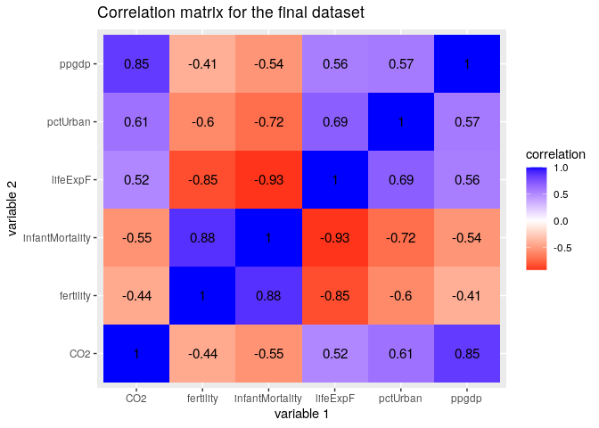
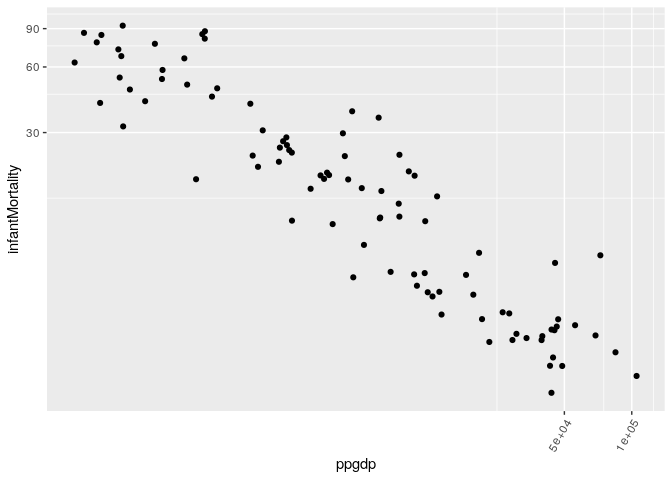
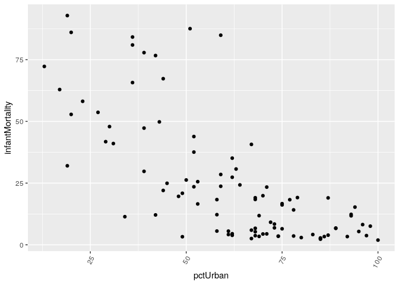
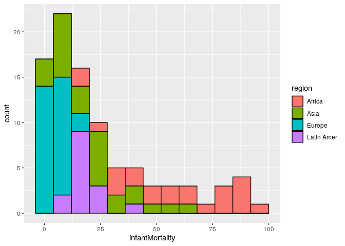
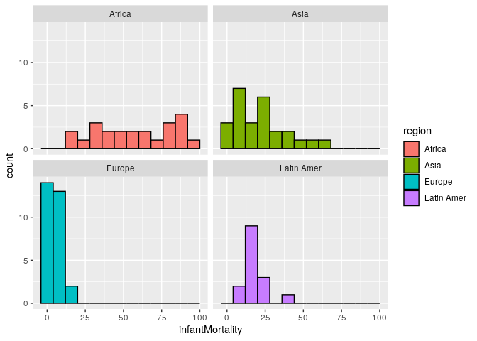
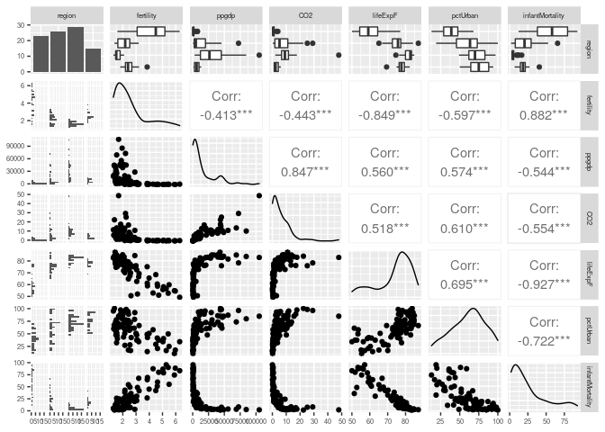
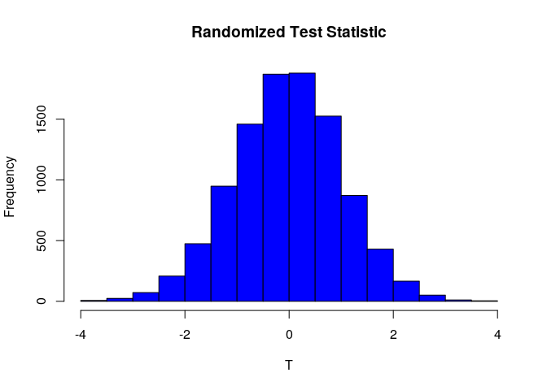
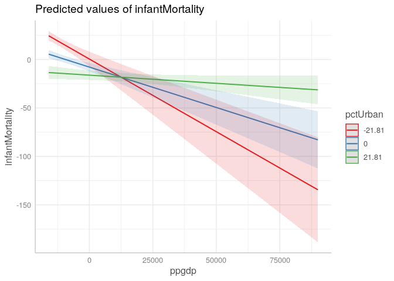
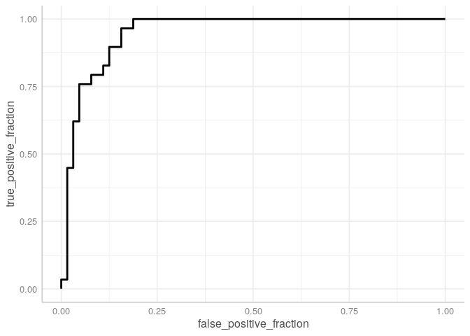

Project2
================
Stephen Koenig
4/18/2021

## Introduction

The data for this project came from the `carData` package which was
modified to list the country names as a variable along with the life
expectancy for a female, the ppgdp, infant mortality rate, percent
urban, and the region the countries resides. The second dataset came
from <https://www.gapminder.org/data/>, using data for the Per capita
carbon dioxide emissions from the fossil fuel consumption etc. in a
given year. This data is interesting to me to see the impact of
CO<sub>2</sub> emissions from urban and rural areas on infant mortality
rates and life expectancy. The main variables from the final combined
dataset are Infant Mortality Rate, or the rate of child death per 1000
live births, ppgdp or the wealth value of the country, and pctUrban, the
percentage of the country that is urbanized. I expect to see a
difference in mean `infant mortality rates` among countries with lower
`ppgdp` or `pctUrban`.

## Tidy

Prep work for the data to clean it for use in later sections.

``` r
emtemp <- emissions %>%
  #Selecting the two variables to add to the new dataset: country and 2010 emission/person in tonnes.
  select(country, `2010`)
#Checking to see if the new `emission` dataset `emtemp` and `UN` is tidy.
head(emtemp)
```

    ## # A tibble: 6 x 2
    ##   country    `2010`
    ##   <chr>       <dbl>
    ## 1 Albania      2.08
    ## 2 Argentina    4.33
    ## 3 Armenia      1.92
    ## 4 Australia   17.3 
    ## 5 Austria     11.6 
    ## 6 Azerbaijan   3.41

``` r
head(UN)
```

    ## # A tibble: 6 x 8
    ##   country      region   group fertility  ppgdp lifeExpF pctUrban infantMortality
    ##   <chr>        <chr>    <chr>     <dbl>  <dbl>    <dbl>    <dbl>           <dbl>
    ## 1 Afghanistan  Asia     other      5.97   499      49.5       23           125. 
    ## 2 Albania      Europe   other      1.52  3677.     80.4       53            16.6
    ## 3 Algeria      Africa   afri…      2.14  4473      75         67            21.5
    ## 4 American Sa… <NA>     <NA>      NA       NA      NA         NA            11.3
    ## 5 Angola       Africa   afri…      5.14  4322.     53.2       59            96.2
    ## 6 Anguilla     Caribbe… other      2    13750.     81.1      100            NA

``` r
datatemp <- emtemp %>%
  inner_join(UN, by="country")

#Cleaning the dataset after merging
datafinal <- datatemp %>%
  #removing regions with only one response
  filter(region != "Oceania") %>%
  filter(region != "Caribbean") %>%
  filter(country != "Canada") %>%
  #Reordering the variables, and removing the `groups` category since it is unnecessary.
  select(country, region, -group, fertility, ppgdp, `2010`, lifeExpF, pctUrban, infantMortality) %>%
  #Renaming the `2020` variable to a more accurate descriptive name.
  rename("CO2" = `2010`)

#making a dataset variation with only numeric variables
datafinal_num <- datafinal %>%
  select_if(is.numeric) 
```

## Explatory Data Analysis

After exploring the data, there appears to be positive relationship
between a few variables, namely life expectancy and percent urban, which
could be explained by the better access to medicine and technology, and
also a negative relationship between infant mortality and percent urban,
which could be explained with similar reasons.

``` r
cor(datafinal_num, use = "pairwise.complete.obs") %>%
  # Save as a data frame
  as.data.frame %>%
  # Convert row names to an explicit variable
  rownames_to_column %>%
  # Pivot so that all correlations appear in the same column
  pivot_longer(-1, names_to = "other_var", values_to = "correlation") %>%
  ggplot(aes(rowname, other_var, fill=correlation)) +
  # Heatmap with geom_tile
  geom_tile() +
  # Change the scale to make the middle appear neutral
  scale_fill_gradient2(low="red",mid="white",high="blue") +
  # Overlay values
  geom_text(aes(label = round(correlation,2)), color = "black", size = 4) +
  # Give title and labels
  labs(title = "Correlation matrix for the final dataset", x = "variable 1", y = "variable 2")
```

<!-- -->

``` r
ggplot(datafinal, aes(ppgdp, infantMortality)) +
  # scatterplot
  geom_point() +
  # High variation between ppgdp and mortality rate, so trying out a logarithmic scale
  coord_trans(x="log10", y="log10") +
  # Setting theme and text elements
  theme(axis.text.x=element_text(angle=60, hjust=1))
```

<!-- -->

``` r
ggplot(datafinal, aes(pctUrban, infantMortality)) +
  # scatterplot
  geom_point() +
  # Setting theme and text elements
  theme(axis.text.x=element_text(angle=60, hjust=1))
```

<!-- -->

``` r
ggplot(datafinal, aes(x = infantMortality, fill = region)) +
  #stacked histogram showing infant mortality rates by region
  geom_histogram(binwidth = 8, color = "black")
```

<!-- -->

``` r
ggplot(datafinal, aes(x = infantMortality, fill = region)) +
  #histogram showing infant mortality rates for each region
  geom_histogram(binwidth = 8, color = "black") +
  facet_wrap(~ region)
```

<!-- -->

``` r
ggpairs(datafinal %>%
          select(2:8)) + theme(text = element_text(size = 7))
```

    ## `stat_bin()` using `bins = 30`. Pick better value with `binwidth`.
    ## `stat_bin()` using `bins = 30`. Pick better value with `binwidth`.
    ## `stat_bin()` using `bins = 30`. Pick better value with `binwidth`.
    ## `stat_bin()` using `bins = 30`. Pick better value with `binwidth`.
    ## `stat_bin()` using `bins = 30`. Pick better value with `binwidth`.
    ## `stat_bin()` using `bins = 30`. Pick better value with `binwidth`.

<!-- -->

## MANOVA

The MANOVA test concluded that for Region, all variables tested are
significant. Post-Hoc follow-up analysis with bonferroni adjustment due
to the 7 tests already performed and the 7 upcoming tests:

#### For fertility

Africa’s mean fertility is significantly different than Asia, Europe,
and Latin America, Asia’s mean fertilty is significantly different from
Europe, and Europe’s fertility mean is significantly different from
Latin America. The only pair not significantly different from each other
is Asia and Latin America.

#### For ppgdp

It was found that Europe’s mean ppgdp was significantly different from
Africa, Asia, and Latin America, with no other combinations being
different from each other. This mean’s that for ppgdp, Europe has the
significantly different mean ppgdp from other regions.

#### For CO<sub>2</sub> emissions

Europe’s mean CO<sub>2</sub> emissions were significantly different from
Africa, Asia, and Latin America, and Asia’s emissions were significantly
different from Africa. This means that for CO<sub>2</sub> emissions,
Europe’s mean emission is significantly different than all other
regions, and Asia’s emissions mean is different from Africa.

#### For female life expectancy

All regions were found to have significantly different means except
between Latin America and Asia, and Latin America and Europe. For urban
percentage, a significant difference in means between Africa and the
three other countries, meaning that Africa has a significantly different
urban percentage than all other regions.

#### For infant mortality rate

It was found that Africa had significantly different mean rates than all
other countries, and that Europe had a significantly different mean rate
than Asia and Latin America, resulting in Africa and Europe having a
significantly different mean infant mortality rates than the other
regions.

#### Assumptions

The assumptions for a MANOVA are that the observations are independent
of one another, that the independent variable is categorical and the
dependent variables are continuous, that the dependent variables are not
correlated above 0.9, and that variance between groups is equal. The
first 3 assumptions are met, and the fourth was met once the regions
with only one response was removed.

``` r
# How do the means of each variable differ between species?
datafinal %>%
  group_by(region) %>%
  summarize(mean(fertility), mean(ppgdp), mean(CO2), mean(lifeExpF), mean(pctUrban), mean(infantMortality))
```

    ## # A tibble: 4 x 7
    ##   region     `mean(fertility)` `mean(ppgdp)` `mean(CO2)` `mean(lifeExpF)`
    ##   <chr>                  <dbl>         <dbl>       <dbl>            <dbl>
    ## 1 Africa                  4.17         1824.       0.978             60.8
    ## 2 Asia                    2.18        14261.       7.75              75.4
    ## 3 Europe                  1.60        31911.      10.5               81.4
    ## 4 Latin Amer              2.49         6695.       2.86              77.5
    ## # … with 2 more variables: mean(pctUrban) <dbl>, mean(infantMortality) <dbl>

``` r
# Perform MANOVA with all response variables listed in cbind()
manova_data <- manova(cbind(fertility, ppgdp, CO2, lifeExpF, pctUrban, infantMortality) ~ region, data = datafinal)
# Output of MANOVA
summary(manova_data)
```

    ##           Df Pillai approx F num Df den Df    Pr(>F)    
    ## region     3 1.2333   10.006     18    258 < 2.2e-16 ***
    ## Residuals 89                                            
    ## ---
    ## Signif. codes:  0 '***' 0.001 '**' 0.01 '*' 0.05 '.' 0.1 ' ' 1

``` r
#bulk anova
anovaALL <- aov(cbind(datafinal$fertility, datafinal$ppgdp, datafinal$CO2, datafinal$lifeExpF, datafinal$pctUrban, datafinal$infantMortality) ~ region, data = datafinal)
#bulk summary
summary(anovaALL)
```

    ##  Response 1 :
    ##             Df Sum Sq Mean Sq F value    Pr(>F)    
    ## region       3 90.325 30.1085  50.134 < 2.2e-16 ***
    ## Residuals   89 53.450  0.6006                      
    ## ---
    ## Signif. codes:  0 '***' 0.001 '**' 0.01 '*' 0.05 '.' 0.1 ' ' 1
    ## 
    ##  Response 2 :
    ##             Df     Sum Sq    Mean Sq F value   Pr(>F)    
    ## region       3 1.3315e+10 4438350517  14.855 6.39e-08 ***
    ## Residuals   89 2.6590e+10  298768597                     
    ## ---
    ## Signif. codes:  0 '***' 0.001 '**' 0.01 '*' 0.05 '.' 0.1 ' ' 1
    ## 
    ##  Response 3 :
    ##             Df Sum Sq Mean Sq F value    Pr(>F)    
    ## region       3 1392.7  464.22  11.994 1.147e-06 ***
    ## Residuals   89 3444.8   38.71                      
    ## ---
    ## Signif. codes:  0 '***' 0.001 '**' 0.01 '*' 0.05 '.' 0.1 ' ' 1
    ## 
    ##  Response 4 :
    ##             Df Sum Sq Mean Sq F value    Pr(>F)    
    ## region       3 5838.0 1946.01  66.097 < 2.2e-16 ***
    ## Residuals   89 2620.3   29.44                      
    ## ---
    ## Signif. codes:  0 '***' 0.001 '**' 0.01 '*' 0.05 '.' 0.1 ' ' 1
    ## 
    ##  Response 5 :
    ##             Df Sum Sq Mean Sq F value    Pr(>F)    
    ## region       3  17278  5759.2  19.351 9.572e-10 ***
    ## Residuals   89  26488   297.6                      
    ## ---
    ## Signif. codes:  0 '***' 0.001 '**' 0.01 '*' 0.05 '.' 0.1 ' ' 1
    ## 
    ##  Response 6 :
    ##             Df Sum Sq Mean Sq F value    Pr(>F)    
    ## region       3  35695 11898.3  48.349 < 2.2e-16 ***
    ## Residuals   89  21902   246.1                      
    ## ---
    ## Signif. codes:  0 '***' 0.001 '**' 0.01 '*' 0.05 '.' 0.1 ' ' 1

``` r
pairwise.t.test(datafinal$fertility, datafinal$region, p.adj = "bonferroni")
```

    ## 
    ##  Pairwise comparisons using t tests with pooled SD 
    ## 
    ## data:  datafinal$fertility and datafinal$region 
    ## 
    ##            Africa  Asia  Europe
    ## Asia       2.4e-13 -     -     
    ## Europe     < 2e-16 0.042 -     
    ## Latin Amer 2.3e-08 1.000 0.003 
    ## 
    ## P value adjustment method: bonferroni

``` r
pairwise.t.test(datafinal$ppgdp, datafinal$region, p.adj = "bonferroni")
```

    ## 
    ##  Pairwise comparisons using t tests with pooled SD 
    ## 
    ## data:  datafinal$ppgdp and datafinal$region 
    ## 
    ##            Africa  Asia   Europe 
    ## Asia       0.0825  -      -      
    ## Europe     8.9e-08 0.0017 -      
    ## Latin Amer 1.0000  1.0000 8.8e-05
    ## 
    ## P value adjustment method: bonferroni

``` r
pairwise.t.test(datafinal$CO2, datafinal$region, p.adj = "bonferroni")
```

    ## 
    ##  Pairwise comparisons using t tests with pooled SD 
    ## 
    ## data:  datafinal$CO2 and datafinal$region 
    ## 
    ##            Africa  Asia   Europe
    ## Asia       0.0016  -      -     
    ## Europe     2.3e-06 0.6301 -     
    ## Latin Amer 1.0000  0.1048 0.0013
    ## 
    ## P value adjustment method: bonferroni

``` r
pairwise.t.test(datafinal$lifeExpF, datafinal$region, p.adj = "bonferroni")
```

    ## 
    ##  Pairwise comparisons using t tests with pooled SD 
    ## 
    ## data:  datafinal$lifeExpF and datafinal$region 
    ## 
    ##            Africa  Asia    Europe 
    ## Asia       4.0e-14 -       -      
    ## Europe     < 2e-16 0.00045 -      
    ## Latin Amer 5.8e-14 1.00000 0.15646
    ## 
    ## P value adjustment method: bonferroni

``` r
pairwise.t.test(datafinal$pctUrban, datafinal$region, p.adj = "bonferroni")
```

    ## 
    ##  Pairwise comparisons using t tests with pooled SD 
    ## 
    ## data:  datafinal$pctUrban and datafinal$region 
    ## 
    ##            Africa  Asia    Europe 
    ## Asia       0.00023 -       -      
    ## Europe     5.3e-09 0.08738 -      
    ## Latin Amer 1.3e-07 0.09479 1.00000
    ## 
    ## P value adjustment method: bonferroni

``` r
pairwise.t.test(datafinal$infantMortality, datafinal$region, p.adj = "bonferroni")
```

    ## 
    ##  Pairwise comparisons using t tests with pooled SD 
    ## 
    ## data:  datafinal$infantMortality and datafinal$region 
    ## 
    ##            Africa  Asia  Europe
    ## Asia       6.1e-11 -     -     
    ## Europe     < 2e-16 0.001 -     
    ## Latin Amer 6.7e-10 1.000 0.043 
    ## 
    ## P value adjustment method: bonferroni

## Randomization Test

In the randomization test, values for fertility were scrambled between
Europe and Africa, and tested to see how significant the data is from a
set of 10000 random iterations of the data. The null hypothesis is that
the our data is not different from the mean random iteration. The
alternate hypothesis is then that our original data is not equal to the
mean random iteration. From the initial t-test, the original data was
given a test statistic of 8.96, meaning that from a normal t
distribution from -4 to 4, our data is incredibly significant. From
10000 samples of randomization, the mean test statistic returned was a
value of -0.01, indication a normal T distribution’s expected mean (or
very close). This concludes that our data is significantly different
from the expected mean of 0, and we can reject the null hypothesis. In
the distribution of randomization graph, our T value’s marker line is
not seen on the graph due to how far to the right of the dirstibution it
lies, indicating significance.

``` r
datafinaladj <- datafinal %>%
  filter(region == "Africa" | region == "Europe")

Fertility <- datafinaladj$fertility
Region <- datafinaladj$region

t.test(Fertility ~ Region)
```

    ## 
    ##  Welch Two Sample t-test
    ## 
    ## data:  Fertility by Region
    ## t = 8.963, df = 22.919, p-value = 5.965e-09
    ## alternative hypothesis: true difference in means is not equal to 0
    ## 95 percent confidence interval:
    ##  1.978220 3.165666
    ## sample estimates:
    ## mean in group Africa mean in group Europe 
    ##             4.174391             1.602448

``` r
realTestStat <- t.test(Fertility ~ Region)$statistic

# Set the number of samples
NSamps1 <- 10000
# Create a container for the results
Tout1 <- rep(0, NSamps1)
# Run the loop
for(i in 1:NSamps1){
  # Randomize the treatments
  Group2 <- sample(Region, length(Region), replace=FALSE)
  # Generate the T-test
  Ttest1 <- t.test(Fertility ~ Group2)
  # Store out the T-test
  Tout1[i] <- Ttest1$statistic
}

mean(Tout1)
```

    ## [1] -0.03527041

``` r
hist(Tout1,
     col = "blue",
     main = 'Randomized Test Statistic',
     xlab = 'T')
abline(v=realTestStat, col = "red")
```

<!-- -->

## Linear Regression Model

According to the linear model predicting Infant Mortality rates from
PPGDP and Percent Urban, Infant mortality rates go down by 3.816e-01 for
every 1 percent increase in Percent Urban, and they decrease by
8.337e-04 for every 1 unit increase in PPGDP, and the interaction
between PPGDP and Percent Urban is positive. All variables including the
interaction are significant. The bootstrap SE’s are much higher than the
robust SEs.

``` r
linregdata <- datafinal_num %>% 
  mutate_at(-1, function(pctUrban)pctUrban-mean(pctUrban)) %>%
  mutate_at(-1, function(ppgdp)ppgdp-mean(ppgdp))

head(linregdata)
```

    ## # A tibble: 6 x 6
    ##   fertility   ppgdp   CO2 lifeExpF pctUrban infantMortality
    ##       <dbl>   <dbl> <dbl>    <dbl>    <dbl>           <dbl>
    ## 1      1.52 -11791. -4.06    6.39     -8.31          -8.43 
    ## 2      2.17  -6306. -1.81    5.88     31.7          -12.7  
    ## 3      1.74 -12438. -4.22    3.32      2.69          -0.723
    ## 4      1.35  29690.  5.46    9.54      6.69         -21.3  
    ## 5      2.15  -9831. -2.73   -0.350    -9.31          12.6  
    ## 6      2.43   2716. 10.8     2.05     27.7          -18.3

``` r
fit <- lm(infantMortality ~ pctUrban + ppgdp + pctUrban * ppgdp, data = linregdata, family = "binomial")
```

    ## Warning: In lm.fit(x, y, offset = offset, singular.ok = singular.ok, ...) :
    ##  extra argument 'family' will be disregarded

``` r
summary(fit)
```

    ## 
    ## Call:
    ## lm(formula = infantMortality ~ pctUrban + ppgdp + pctUrban * 
    ##     ppgdp, data = linregdata, family = "binomial")
    ## 
    ## Residuals:
    ##     Min      1Q  Median      3Q     Max 
    ## -34.243  -9.819  -1.711   5.590  54.012 
    ## 
    ## Coefficients:
    ##                  Estimate Std. Error t value Pr(>|t|)    
    ## (Intercept)    -7.871e+00  2.227e+00  -3.534 0.000652 ***
    ## pctUrban       -3.816e-01  1.092e-01  -3.493 0.000745 ***
    ## ppgdp          -8.337e-04  1.521e-04  -5.482 3.88e-07 ***
    ## pctUrban:ppgdp  3.051e-05  6.123e-06   4.983 3.06e-06 ***
    ## ---
    ## Signif. codes:  0 '***' 0.001 '**' 0.01 '*' 0.05 '.' 0.1 ' ' 1
    ## 
    ## Residual standard error: 15.14 on 89 degrees of freedom
    ## Multiple R-squared:  0.6458, Adjusted R-squared:  0.6338 
    ## F-statistic: 54.08 on 3 and 89 DF,  p-value: < 2.2e-16

``` r
theme_set(theme_sjplot())
# make categorical
linregdata$pctUrban <- to_factor(linregdata$pctUrban)
# Plot the interaction
plot_model(fit, type = "pred", terms = c("ppgdp", "pctUrban"))
```

<!-- -->

``` r
bootse <- function(x, n = 5000){
  # Create an empty vector to store the means
  means <- vector()
  # Create n samples
  for(i in 1:n){
    # Compute the mean for each sample
    means[i] <- mean(sample(x, replace = TRUE))
  }
  # Calculate the standard error 
  return(sd(means))
}


# Compute the mean and bootstrap standard error each explanatory variable
mean_se <- datafinal %>%
  group_by(region) %>%
  summarize(mean_ppgdp = mean(ppgdp),
            se = bootse(ppgdp),
            mean_pctUrban = mean(pctUrban),
            se2 = bootse(pctUrban))
mean_se
```

    ## # A tibble: 4 x 5
    ##   region     mean_ppgdp    se mean_pctUrban   se2
    ##   <chr>           <dbl> <dbl>         <dbl> <dbl>
    ## 1 Africa          1824.  444.          39.3  3.08
    ## 2 Asia           14261. 3582.          60.8  4.63
    ## 3 Europe         31911. 4641.          72.4  2.19
    ## 4 Latin Amer      6695. 1034.          74.5  3.72

``` r
summary(fit, robust = T)
```

    ## 
    ## Call:
    ## lm(formula = infantMortality ~ pctUrban + ppgdp + pctUrban * 
    ##     ppgdp, data = linregdata, family = "binomial")
    ## 
    ## Residuals:
    ##     Min      1Q  Median      3Q     Max 
    ## -34.243  -9.819  -1.711   5.590  54.012 
    ## 
    ## Coefficients:
    ##                  Estimate Std. Error t value Pr(>|t|)    
    ## (Intercept)    -7.871e+00  2.227e+00  -3.534 0.000652 ***
    ## pctUrban       -3.816e-01  1.092e-01  -3.493 0.000745 ***
    ## ppgdp          -8.337e-04  1.521e-04  -5.482 3.88e-07 ***
    ## pctUrban:ppgdp  3.051e-05  6.123e-06   4.983 3.06e-06 ***
    ## ---
    ## Signif. codes:  0 '***' 0.001 '**' 0.01 '*' 0.05 '.' 0.1 ' ' 1
    ## 
    ## Residual standard error: 15.14 on 89 degrees of freedom
    ## Multiple R-squared:  0.6458, Adjusted R-squared:  0.6338 
    ## F-statistic: 54.08 on 3 and 89 DF,  p-value: < 2.2e-16

## Logistic Regression

The logistic regression predicts the outcome of a binary response
variable. In this case, I am predicting whether or not a country is in
Europe based off of ppgdp, percent urban, and infant mortality rate.
According to the coefficients, Controlling for percent urban and infant
mortality, ppgdp is not significantly different. Controlling for
pctUrban and infantMortality, for every 1 unit increase in ppgdp, the
probability of being a European country is changed by a factor is
1.0000. Controlling for ppgdp and infant mortality, for every 1 unit
increase in `pctUrban` the probability of being a European country is
changed by a factor 0.943. Controlling for ppgdp and pctUrban, for every
1 unit increase in `infantMortality`, the probability of being a
European country is changed by a factor of 0.698. This is what I
expected for ppgdp and infant mortality, but not for percent urban.
Since the ROC plot has an AUC of 0.949, this model is a great fit for
the prediction of region by ppgdp, percent urban, and infant mortality.

``` r
odds <- function(p)p/(1-p)

# We also need to define the logit link function (logarithm of odds)
logit <- function(p) log(odds(p))

# Logistic model
logistic <- function(x){exp(x) / (1 + exp(x))}


logdatafinal <- datafinal %>%
  select(region, ppgdp, pctUrban, infantMortality) %>%
  mutate(y = ifelse(region == "Europe", 1, 0)) 

# Fit a new regression model
fit2 <- glm(y ~ ppgdp + pctUrban + infantMortality, data = logdatafinal, family = 'binomial')
summary(fit2)
```

    ## 
    ## Call:
    ## glm(formula = y ~ ppgdp + pctUrban + infantMortality, family = "binomial", 
    ##     data = logdatafinal)
    ## 
    ## Deviance Residuals: 
    ##     Min       1Q   Median       3Q      Max  
    ## -2.2801  -0.2222  -0.0041   0.4922   1.9637  
    ## 
    ## Coefficients:
    ##                   Estimate Std. Error z value Pr(>|z|)    
    ## (Intercept)      7.272e+00  2.399e+00   3.031 0.002439 ** 
    ## ppgdp            2.005e-06  2.076e-05   0.097 0.923053    
    ## pctUrban        -5.851e-02  2.756e-02  -2.123 0.033727 *  
    ## infantMortality -3.592e-01  9.848e-02  -3.647 0.000265 ***
    ## ---
    ## Signif. codes:  0 '***' 0.001 '**' 0.01 '*' 0.05 '.' 0.1 ' ' 1
    ## 
    ## (Dispersion parameter for binomial family taken to be 1)
    ## 
    ##     Null deviance: 115.423  on 92  degrees of freedom
    ## Residual deviance:  48.333  on 89  degrees of freedom
    ## AIC: 56.333
    ## 
    ## Number of Fisher Scoring iterations: 8

``` r
# Interpret the coefficients by considering the odds (inverse of log(odds))
exp(coef(fit2))
```

    ##     (Intercept)           ppgdp        pctUrban infantMortality 
    ##     1438.760130        1.000002        0.943167        0.698237

``` r
fit2 <- glm(y ~ ppgdp + pctUrban + infantMortality, data = logdatafinal, family = 'binomial')
summary(fit2)
```

    ## 
    ## Call:
    ## glm(formula = y ~ ppgdp + pctUrban + infantMortality, family = "binomial", 
    ##     data = logdatafinal)
    ## 
    ## Deviance Residuals: 
    ##     Min       1Q   Median       3Q      Max  
    ## -2.2801  -0.2222  -0.0041   0.4922   1.9637  
    ## 
    ## Coefficients:
    ##                   Estimate Std. Error z value Pr(>|z|)    
    ## (Intercept)      7.272e+00  2.399e+00   3.031 0.002439 ** 
    ## ppgdp            2.005e-06  2.076e-05   0.097 0.923053    
    ## pctUrban        -5.851e-02  2.756e-02  -2.123 0.033727 *  
    ## infantMortality -3.592e-01  9.848e-02  -3.647 0.000265 ***
    ## ---
    ## Signif. codes:  0 '***' 0.001 '**' 0.01 '*' 0.05 '.' 0.1 ' ' 1
    ## 
    ## (Dispersion parameter for binomial family taken to be 1)
    ## 
    ##     Null deviance: 115.423  on 92  degrees of freedom
    ## Residual deviance:  48.333  on 89  degrees of freedom
    ## AIC: 56.333
    ## 
    ## Number of Fisher Scoring iterations: 8

``` r
probs = predict(fit2, type = "response")
predicted = ifelse(probs > 0.5, 1, 0)
truth = logdatafinal$y
performance <- data.frame(
  probs = predict(fit2, type = "response"),
  predicted = ifelse(probs > 0.5, 1, 0),
  truth = logdatafinal$y
)


ROCplot <- ggplot(performance) + geom_roc(aes(d = truth, m = probs), n.cuts = 0)
ROCplot
```

<!-- -->

``` r
AUC <- calc_auc(ROCplot)$AUC
AUC
```

    ## [1] 0.9493534
